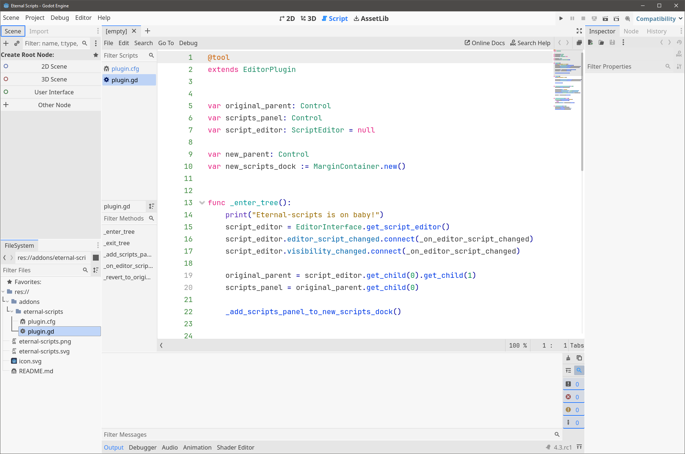
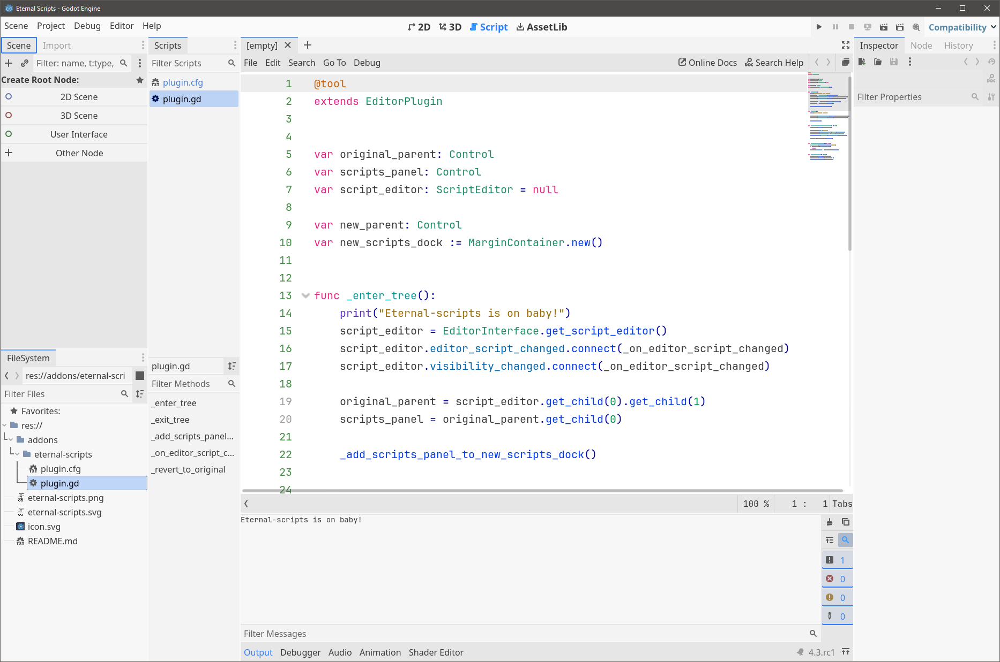

Puts the script list in a separate dock to make them always visible, and makes sure that even if you're in 2D/3D/AssetLib or some other view, by clicking on one of the script names it switches back to the script editor.

Before:

After:

